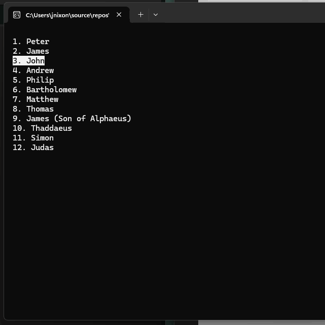

# Assignment 03



## Universal Acceptance Criteria  

This represents acceptance criteria that is true irrespective of assignment criteria.

- You **must understand** every single line of your solution.
- Your code **must compile and run** without errors.
- You **must turn in your repository URL** in Brightspace.

## Assignment Acceptance Criteria  

This represents acceptance criteria necessary for assignment completion.

### 1️⃣ Menu Display & Navigation  
- Retrieve a **list of menu items** using `Api.GetStringArrayAsync()`.  
- Display the **menu items** in the console.  
- Allow **navigation** using:
  - **Up Arrow** to move selection up.
  - **Down Arrow** to move selection down.  
  - **Enter** to confirm selection.  

### 2️⃣ Menu Interaction & Selection  
- **Highlight the selected menu item** and unhighlight previous selections.  
- When an item is selected:
  - **Clear the console**.  
  - Display the selected item inside a **boxed UI** using `Screen.SurroundWithBox()`.  
  - Show a **"Press any key to continue"** message.  
  - Wait for a key press before returning to the menu.  

### 3️⃣ Program Behavior & Structure  
- Return to the **main menu** after a selection is made.  
- **Exit gracefully** when needed (optional Escape key handling).  
- Place as much logic as possible in `Client.Library`.  
- Ensure the **console cursor is hidden** for a cleaner UI.  

## Bonus Acceptance Criteria  

This represents optional acceptance criteria available for additional learning and bonus.

- **Improve the menu experience**:  
  - Implement a **smooth scrolling effect** when navigating.  
  - Play a **console beep** when pressing Up, Down, or Enter.  
- **Enhance exit behavior**:  
  - Allow **Escape key to exit gracefully**, displaying a **"Goodbye"** message before closing.  
- **Add a secret feature**:  
  - If the user types `"hidden"`, display a **"Secret Menu Unlocked!"** message.  

---

This version keeps the **core structure intact**, while grouping the acceptance criteria into logical sections for clarity. Let me know if you'd like further refinements! 🚀

### Useful information

`Console.ReadKey().Key` lets you read and identify key presses in a C# console application. The `Console.ReadKey()` method waits for the user to press a key and gives back a `ConsoleKeyInfo` object. That object includes details like what key was pressed and whether Shift, Alt, or Ctrl was used. The `.Key` property specifically tells you which key was pressed, using the `ConsoleKey` enum, with values like `Enter`, `Escape`, or `A`. It’s a simple and effective way to handle user input.

```csharp
Console.WriteLine("Press any key:");
// Reads the keypress as keyInfo metadata
ConsoleKeyInfo keyInfo = Console.ReadKey(); 
// Extracts the key itself from keyInfo metadata
ConsoleKey key = keyInfo.Key; 
Console.WriteLine($"\nYou pressed: {key}");
```

## Getting Started

1. **Clone Your Repository**

   - GitHub Classroom: https://classroom.github.com/a/xLLZSm4E
   - Open the new, local folder
   

1. **Configure Debugging**

   - Open Settings (`Ctrl+,`) and search for `csharp.debug.console`.
   - Set its value to `externalTerminal`.

1. **Create Solution Structure**

```text
Assignment02.sln
├── .gitignore
├── .editorconfig
├── Client
│   ├── Client.csproj
│   ├── Program.cs 
│   └── References: Client.Library
└── Client.Library
    ├── Client.Library.csproj
    └── Class1.cs (Rename to Logic.cs)
```

This is the command line, try doing it inside VS Code using the user interface. The result is the same, using the UI inside Code just helps you learn how it works. You can always "fall back" to this command line syntax.

```bash
// create base files
dotnet new gitignore
dotnet new editorconfig

// create the projects
dotnet new console -n Client -o Client
dotnet new classlib -n Client.Library -o Client.Library
dotnet add Client/Client.csproj reference Client.Library/Client.Library.csproj

// create the solution
dotnet new sln -n Assignment02
dotnet sln Assignment02.sln add Client/Client.csproj
dotnet sln Assignment02.sln add Client.Library/Client.Library.csproj

// test the app
dotnet restore
dotnet build
dotnet run --project Client
```

> Unlike the last assignment, do not use the command palette to create debug assets. Running this command creates the `launch.json` and `tasks.json` files in the `.vscode` folder. This is very valuable for sophisticated scenarios, but not ours—this is simple. 

### Now you can do your assignment

 * Read the *Acceptance Criteria*!
 * Keep committing your changes with git.
 * Remember to push your final work!
 * Turn in the URL to your repository.
